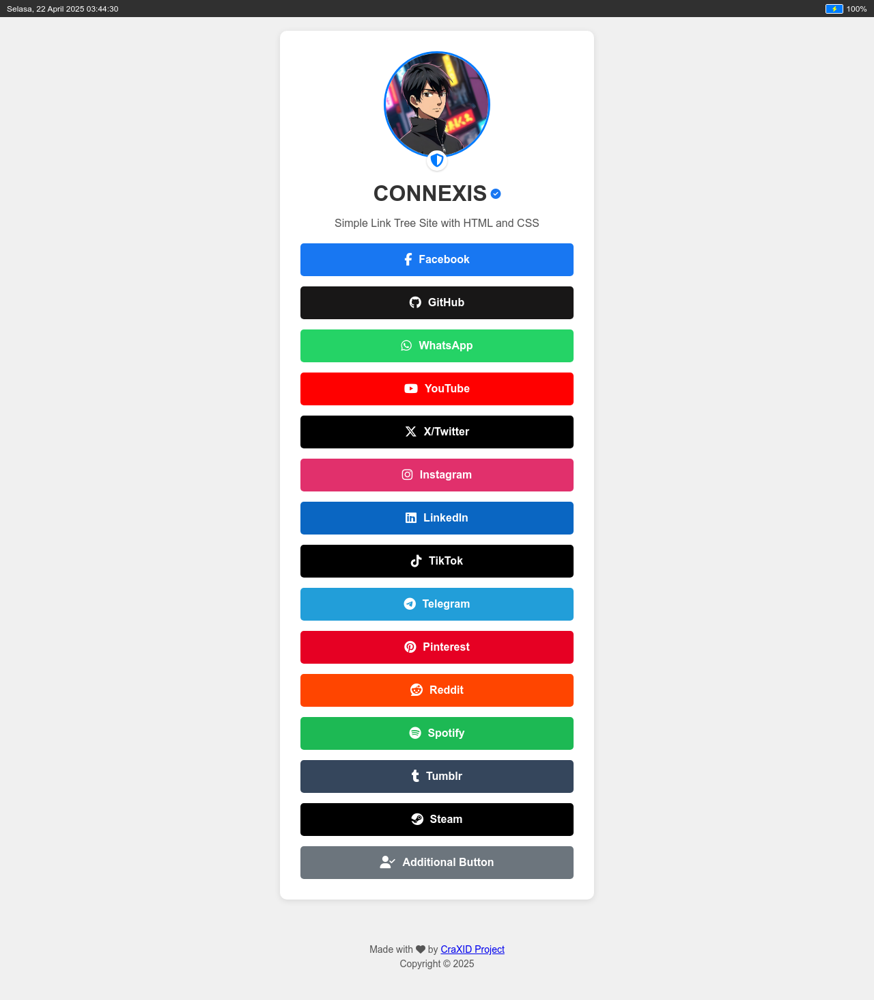

[https://connexis.onrender.com](https://connexis.onrender.com)
# CONNEXIS - Personal Link Page

This is the repository for **Connexis**, a personal link page created by me⁩. It serves as a central hub for accessing various online profiles and contact points.

## Overview

Connexis is a simple, static web page designed to function as a digital business card or a link-in-bio page.

## Features

*   Profile display with image, name, and status.
*   Links to various social media and online platforms.
*   Dynamic status bar showing time and battery status.
*   Responsive design.

## Technologies

Built using HTML, CSS, and JavaScript, incorporating Font Awesome for icons.

## Setup

To use this project:
1.  Clone or download the files.
2.  Ensure `index.html`, `style.css`, and **all image files (`profile.jpg`) are placed in the `./media/` directory** relative to `index.html`.
3.  Open `index.html` in a web browser.

## Credits

*   **Developer:** @CraXID
*   **Origin:** CraXID Project

## Support

If you wish to support the developer, contributions are greatly appreciated!

*   **For users in Indonesia:** Scan the QRIS code:
    
*   **For international users:** Donate via PayPal:
    [https://paypal.me/dedeklender](https://paypal.me/dedeklender)

## License

MIT License
